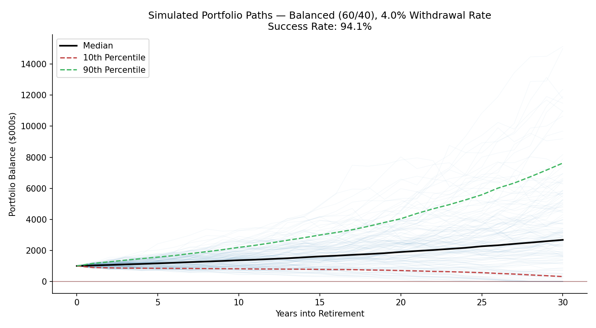
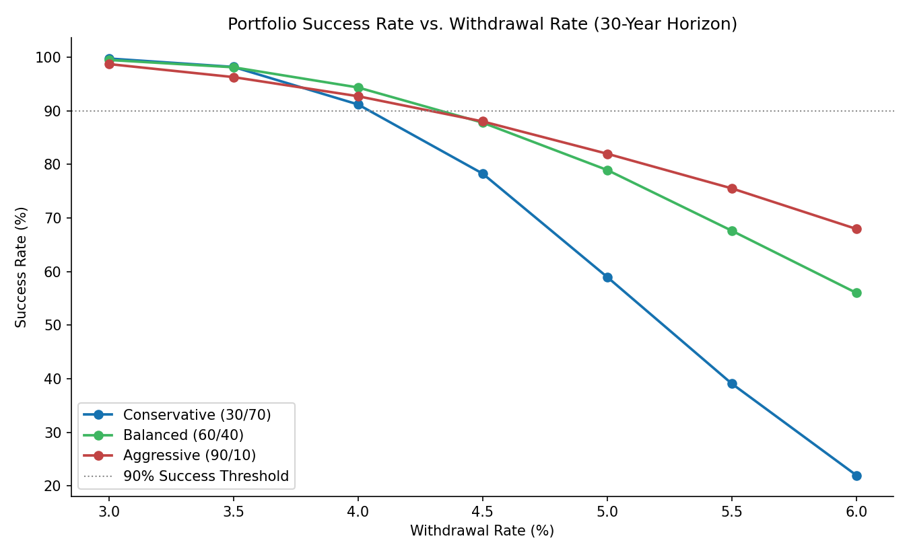

# Monte Carlo Retirement Withdrawal Simulator

**Prepared by:** Peter Velez Vereš
**Date:** July 19, 2026
**Methodology:** Monte Carlo Simulation, Safe Withdrawal Rate Analysis (Trinity Study Framework)

---

## Executive Summary

This tool answers a specific question: **given a portfolio balance, an asset allocation, and a withdrawal rate, what is the probability the portfolio survives a 30-year retirement without being depleted?** It applies the methodology popularized by the Trinity Study — simulating thousands of possible market return sequences, applying an inflation-adjusted annual withdrawal against each, and measuring the fraction of simulations that never run out of money.

For a base case of a $1,000,000 portfolio, a 60/40 stock/bond allocation, and the commonly cited "4% rule," the simulation returns a **94.1% success rate** over a 30-year horizon — closely in line with the ~95% figure widely cited from the original Trinity Study and its successors. The tool also computes the withdrawal rate needed to hit a 90% success target across three allocations, and shows how success probability degrades as the withdrawal rate increases.

This is a personal finance planning tool built on illustrative long-run return assumptions. It is not investment advice, and actual outcomes depend on assumptions this tool cannot verify in advance — see Limitations.

---

## 1. Methodology

**Approach:** Monte Carlo simulation of annual portfolio returns, with a fixed initial withdrawal rate applied to the starting balance and grown each year at an assumed inflation rate — this "constant real withdrawal" approach is the same one used in the original Trinity Study (Cooley, Hubbard, and Walz, 1998) and its widely cited updates.

| Step | Description |
|---|---|
| 1 | Set initial balance, withdrawal rate, allocation, and horizon |
| 2 | Simulate annual returns for 5,000 (base case) or 3,000 (sweep) portfolio paths using a normal distribution calibrated to the blended stock/bond return and volatility |
| 3 | Each year, apply the inflation-adjusted withdrawal, deplete or grow the balance accordingly |
| 4 | A simulation "succeeds" if the balance remains above $0 through the full horizon |
| 5 | Success rate = fraction of simulations that succeed |
| 6 | Repeat across a grid of withdrawal rates and three allocations to map the full trade-off |

## 2. Assumptions

| Asset Class | Annual Return | Annual Volatility |
|---|---|---|
| Stocks | 10.0% | 16.0% |
| Bonds | 4.0% | 6.0% |

Stock/bond correlation: 0.10. Assumed inflation: 2.5% (used to grow the annual withdrawal amount in real terms). These are long-run stylized assumptions, consistent with those used in the `portfolio-theory-and-risk-management` repository — not a fitted or backtested historical distribution.

## 3. Base Case Results

**$1,000,000 portfolio · 60/40 allocation · 4.0% withdrawal rate · 30-year horizon**

| Metric | Value |
|---|---|
| Expected Portfolio Return | 7.60% |
| Portfolio Volatility | 10.13% |
| Annual Withdrawal (Year 1) | $40,000 |
| **Success Rate** | **94.1%** |



The fan chart shows the range of simulated outcomes — the median path grows substantially over 30 years, but the 10th-percentile path illustrates **sequence-of-returns risk**: portfolios that experience poor market returns in the early years of retirement are disproportionately damaged, even if long-run average returns are unchanged, because withdrawals compound the effect of early losses.


## 4. Safe Withdrawal Rate by Allocation

Withdrawal rate required to achieve a 90% success probability, by allocation:

| Allocation | Safe Withdrawal Rate (90% Success) |
|---|---|
| Conservative (30% stocks / 70% bonds) | 4.0% |
| Balanced (60% stocks / 40% bonds) | 4.3% |
| Aggressive (90% stocks / 10% bonds) | 4.3% |



**Full sweep** (success rate at each withdrawal rate, by allocation):

| Withdrawal Rate | Conservative | Balanced | Aggressive |
|---|---|---|---|
| 3.0% | 99.7% | 99.5% | 98.7% |
| 3.5% | 98.2% | 98.1% | 96.3% |
| 4.0% | 91.2% | 94.3% | 92.7% |
| 4.5% | 78.3% | 87.8% | 88.0% |
| 5.0% | 59.0% | 78.9% | 82.0% |
| 5.5% | 39.1% | 67.6% | 75.5% |
| 6.0% | 22.0% | 56.0% | 67.9% |

## 5. Discussion

The Conservative allocation's success rate falls off faster than the other two as the withdrawal rate rises past 4% — counterintuitively, being "too conservative" can increase failure risk at higher withdrawal rates, because lower expected returns leave less cushion against inflation-adjusted withdrawals compounding over 30 years. This is a well-documented finding in the retirement planning literature: some allocation to equities generally improves long-horizon success rates versus an all-bond portfolio, even though bonds are lower-volatility year to year.

The Balanced and Aggressive allocations converge to a similar safe withdrawal rate (4.3%) at the 90% threshold, but their distributions differ — the Aggressive allocation has a wider range of outcomes (higher upside, but also a fatter left tail in bad scenarios not fully captured by a single success-rate number).

## 6. Limitations

- Returns are simulated from a normal distribution; real market returns exhibit fat tails and volatility clustering (see the `financial-econometrics` repository's GARCH model) that this simplified simulation does not capture
- Inflation is modeled as a fixed 2.5% rather than stochastic, understating uncertainty in real withdrawal amounts
- No sequence-of-returns mitigation strategies are modeled (e.g., reducing withdrawals in down years, a "guardrails" approach, or a bond tent glide path)
- No fees, taxes, or required minimum distributions are incorporated
- Stock and bond return/volatility assumptions are static long-run averages, not regime-dependent or forward-looking (e.g., adjusted for current valuations or interest rates)
- This models a fixed real-dollar withdrawal only; it does not model variable withdrawal strategies (e.g., percentage-of-portfolio, which cannot fully deplete by construction but produces variable income)

## 7. Next Steps

Add stochastic inflation and a fat-tailed return distribution (Student's-t, calibrated similarly to the GARCH work elsewhere in this portfolio), and implement a dynamic withdrawal strategy (e.g., Guyton-Klinger guardrails) for comparison against the fixed-real-withdrawal baseline used here.

---

## Technical Appendix

**Tech Stack:** `Python 3.x` · `numpy` · `matplotlib`

**Data / Assumptions:** This tool uses forward-looking illustrative assumptions rather than a live or historical data pull — there is no live/fallback data distinction, since the exercise is simulation-based planning, not historical analysis. Asset class return/volatility figures are documented in `src/retirement_simulator.py` and are consistent with the assumptions used in the `portfolio-theory-and-risk-management` repository.

**Repository Structure**

```
retirement-withdrawal-simulator/
├── README.md
├── requirements.txt
├── src/
│   └── retirement_simulator.py
└── outputs/
    ├── portfolio_balance_paths.png
    ├── success_rate_by_withdrawal_rate.png
    └── ending_balance_distribution.png
```

**How to Run**

```bash
git clone https://github.com/velezverespeter/applied-financial-tools.git
cd applied-financial-tools/retirement-withdrawal-simulator
pip install -r requirements.txt

python src/retirement_simulator.py                              # default: $1M, 4%, 30 years
python src/retirement_simulator.py --balance 500000 --rate 0.035 --years 25
```

**License:** MIT (see LICENSE)

---

<sub>This document is an independent academic and personal-finance planning exercise. It does not constitute investment advice, financial planning advice, or a recommendation regarding any specific withdrawal rate or asset allocation for any individual, and should not be relied upon as such — consult a qualified financial planner for personal retirement planning. All assumptions are illustrative long-run stylized figures, not guarantees or forecasts of future returns.</sub>
